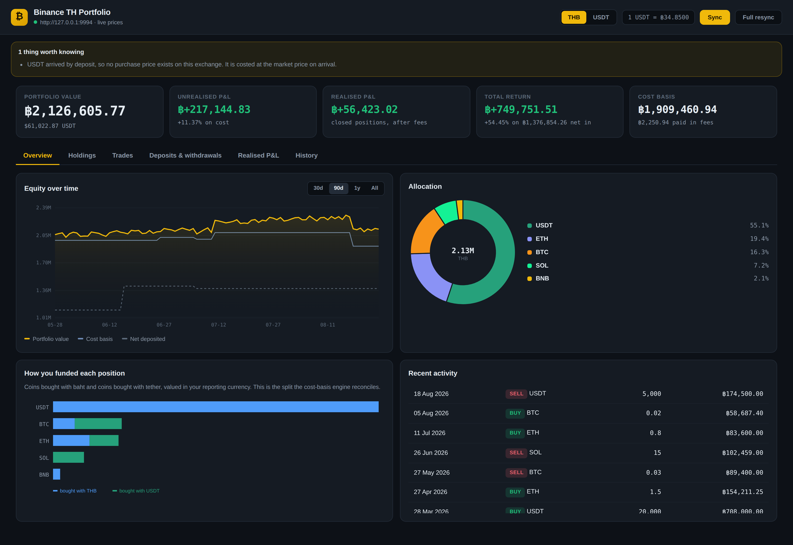

# Binance TH Portfolio Tracker

A complete portfolio view for a [Binance TH](https://www.binance.th) spot
account: every deposit, every withdrawal, every fill, live P&L, and a daily
history — with cost basis tracked **simultaneously in Thai baht and tether**,
because most Thai accounts buy some coins with THB and some with USDT.

It runs entirely on your own machine. Your API keys never leave it, and all
history is cached in a local SQLite file so the dashboard still works when the
exchange is slow or you are offline.



---

## Quick start

```bash
git clone <this repo> && cd binanceth-tracker
cp .env.example .env          # then paste your API key + secret into .env
./run.sh                      # creates a venv, installs deps, serves the app
```

Open <http://127.0.0.1:8787>. The first load kicks off a sync automatically;
pulling a few years of history takes a minute or two.

Prefer to drive it from a terminal?

```bash
./run.sh sync            # fetch new activity, print a summary
./run.sh sync --full     # re-fetch everything from scratch
./run.sh sync --deep     # also scan every listed pair for forgotten fills
```

**Create the key with read-only permissions.** This app never places orders or
moves funds, so "Enable Reading" is all it needs. Leave trading and withdrawals
switched off.

---

## What you get

| Tab | What it shows |
| --- | --- |
| **Overview** | Equity curve against cost basis and net deposits, allocation donut, and a breakdown of which positions you funded with baht versus tether |
| **Holdings** | Per-asset quantity, average cost, live price, cost basis, market value, unrealised P&L, ROI and portfolio weight |
| **Trades** | Every fill, filterable by asset, side, and whether it was a THB- or USDT-quoted pair |
| **Deposits & withdrawals** | Fiat and crypto movements both ways, with fees, network, status and what each is worth today |
| **Realised P&L** | Every closed lot with its cost, proceeds, P&L, ROI and holding period |
| **History** | Daily equity, cost basis, unrealised and cumulative realised P&L |

Prices refresh every few seconds and stream to the browser over SSE, so the
headline numbers and the holdings table move on their own. Flip the whole
dashboard between THB and USDT with the toggle in the top right — every number
on every tab is already computed in both.

---

## How the baht / tether problem is solved

This is the part worth understanding, because it is where naive trackers go
wrong.

Say you buy 1,000 USDT at ฿34.00, and a week later — with the rate now at
฿36.00 — you spend 750 of them on SOL. What is your SOL cost basis in baht?

* A tracker that converts at the trade date says **฿27,000** (750 × 36.00).
* You actually paid **฿25,500** for those tethers.

The difference is a ฿1,500 currency move that has nothing to do with SOL. This
app defaults to `FX_MODE=lots`, which traces the baht you really spent:
buying a coin with a stablecoin is treated as *funding*, so the baht basis
rides through into the coin and no phantom FX gain is realised on the tether
leg. Those legs appear in the Realised P&L tab tagged **"Funded a buy"** and
are excluded from your win rate.

Set `FX_MODE=market` if you would rather convert at the rate on the day and
realise the FX gain on the stablecoin at that moment.

Either way:

* **Every fill is valued in both currencies at the moment it happened**, using
  the trade's own execution price whenever a leg is already baht or tether —
  not a candle lookup after the fact.
* **Trades quoted in a crypto** (BTC, BNB, …) always realise normally. Spending
  appreciated BTC to buy an altcoin is a genuine disposal, and hiding it would
  understate what happened.
* **Idle tether is a position, not cash.** Holding USDT is a real FX exposure
  for a baht-based investor, so it carries a cost basis and shows unrealised
  P&L. Idle baht is treated as cash and never generates P&L against itself.

### Other accounting rules

* **Cost basis method** — `fifo` (default, and the convention Thai capital-gains
  reporting follows) or `avg` for a weighted average. Set `COST_BASIS_METHOD`.
* **Fees** — handled wherever they land. Charged in the coin you bought, your
  quantity drops and the outlay is unchanged. Charged in the quote, it is added
  to what you spent. Charged in BNB, the BNB lot is consumed and its value is
  added to the position's cost.
* **Crypto withdrawals** are a transfer, not a sale, so they realise nothing by
  default. Set `TREAT_WITHDRAWAL_AS_SALE=true` to mark them out at market
  instead.
* **Deposited coins** have no purchase price on this exchange, so they are
  costed at the market price on arrival and flagged `est. cost` in the UI.
* **Balance reconciliation** — if your real balance disagrees with what the
  trade history explains (airdrops, staking, or history older than the sync
  window), the position is adjusted to match the exchange and you get a banner
  saying exactly what changed. The dashboard never quietly shows a number that
  disagrees with the Binance app.

### The top-line numbers

* **Unrealised P&L** — market value of open positions minus their cost basis.
* **Realised P&L** — proceeds minus cost on closed lots, excluding transfers
  and funding conversions.
* **Total return** — `equity + withdrawals − deposits`, with each transfer
  valued at the time it happened. This is the honest "am I up?" number: it
  cannot be flattered by moving money around.

---

## Configuration

Everything lives in `.env` — see [`.env.example`](.env.example) for the full
list with comments.

| Variable | Default | Meaning |
| --- | --- | --- |
| `BINANCE_TH_API_KEY` / `_SECRET` | — | Read-only API credentials |
| `BASE_CURRENCY` | `THB` | Which currency the dashboard opens in |
| `COST_BASIS_METHOD` | `fifo` | `fifo` or `avg` |
| `FX_MODE` | `lots` | `lots` traces real baht paid; `market` converts on the day |
| `TREAT_WITHDRAWAL_AS_SALE` | `false` | Whether withdrawals realise P&L |
| `PRICE_REFRESH_SECONDS` | `5` | Live price polling interval |
| `DB_PATH` | `data/portfolio.db` | Where history is cached |
| `HOST` / `PORT` | `127.0.0.1:8787` | Where the dashboard listens |
| `BINANCE_TH_BASE_URL` | auto | Override the API host |
| `BINANCE_TH_DIALECT` | auto | Force `openv1` or `apiv3` |

### About that last pair

Binance TH publishes a *"REST Open API v1.0.0"* — the white-label spec Binance
ships for its licensed local exchanges. It authenticates exactly like
binance.com (`X-MBX-APIKEY` header, HMAC-SHA256 over the query string, verified
here against Binance's own published test vector) but several endpoints sit
under `/open/v1/` and wrap their payload in a `{"code":0,"data":{…}}` envelope
rather than returning it bare. Some deployments also expose the classic
`/api/v3/` surface.

Rather than betting on one, the client describes **both dialects and probes at
startup**, and the response parsers are deliberately tolerant about field names
(`insertTime` vs `createTime`, `list` vs `rows`) because local exchanges rename
things. If auto-detection picks wrong, pin it with `BINANCE_TH_DIALECT`.

---

## Development

```bash
python3 -m pytest              # 18 tests: accounting rules + full integration
python3 tools/mock_binance_th.py --port 9998   # a fake exchange to develop against
```

The mock serves a synthetic account that exercises the cases that matter —
baht-quoted buys, tether-quoted buys, a stablecoin funding leg, fiat deposits,
a crypto withdrawal and a BNB-paid commission — in either dialect:

```bash
BINANCE_TH_BASE_URL=http://127.0.0.1:9998 \
BINANCE_TH_API_KEY=demo BINANCE_TH_API_SECRET=demo \
python3 -m app.main sync
```

### Layout

```
app/
  client.py     signed REST client — signing, clock sync, rate limits, retries
  dialects.py   endpoint maps and tolerant parsers for both API dialects
  pricing.py    price routing (BTC→THB direct, SOL→USDT→THB, …) live + historical
  portfolio.py  the cost-basis engine and the daily history replay
  sync.py       incremental fetch: symbol discovery, windowed pagination
  store.py      SQLite schema and queries
  service.py    long-lived state, live price loop, JSON serialisation
  api.py        HTTP routes and the SSE stream
  static/       the dashboard — vanilla JS, hand-rolled canvas charts, no build step
tools/
  mock_binance_th.py   a stand-in exchange for development
```

No frontend build step and no chart library: the dashboard is three static
files, and the charts are drawn directly on canvas.

---

## Security

* `.env` and `data/` are gitignored. Credentials are never written to the
  database, the logs, or the API responses (`/api/status` masks the key).
* The server binds to `127.0.0.1` by default. It has no authentication, so do
  not expose it to a network you do not control.
* Use a **read-only** API key. If a key with trading or withdrawal rights ever
  leaks, an attacker can drain the account; a read-only key can only embarrass
  you.
* If a key has ever been pasted into a chat window, an issue tracker, or a
  screenshot, **delete it in API Management and create a new one.** Rotation is
  free and takes a minute.
